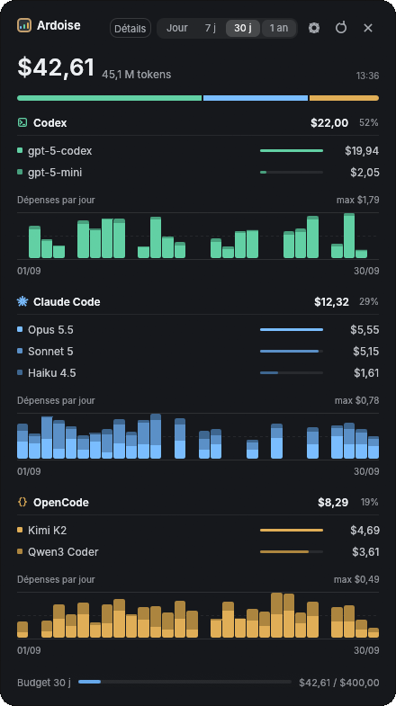

# Ardoise

[](https://github.com/NoxFr/ardoise/actions/workflows/ci.yml)


Petit widget de bureau pour suivre ce que coûtent vos agents de code : Claude Code, Codex
et OpenCode. Tout est lu en local, rien ne part sur le réseau.

<p align="center"></p>

## Ce qu'il lit

| Agent | Source | Coût |
|---|---|---|
| Claude Code | `~/.claude/projects/**/*.jsonl` | estimé au tarif API Anthropic |
| Codex | `~/.codex/sessions/**/rollout-*.jsonl` | estimé au tarif API OpenAI |
| OpenCode | `~/.local/share/opencode/opencode.db` | celui qu'enregistre OpenCode |

Les chemins suivent `CLAUDE_CONFIG_DIR`, `CODEX_HOME` et `XDG_DATA_HOME` s'ils sont définis.

## Installation

Il faut une toolchain Rust ([rustup](https://rustup.rs)).

```bash
git clone https://github.com/NoxFr/ardoise && cd ardoise
cargo install --path . --root ~/.local --locked
install -Dm644 assets/icon.png ~/.local/share/icons/hicolor/256x256/apps/ardoise.png
install -Dm644 assets/ardoise.desktop ~/.local/share/applications/ardoise.desktop
```

Ardoise apparaît ensuite dans le menu des applications, ou se lance avec `ardoise`.

## Utilisation

- **Jour · 7 j · 30 j · 1 an** : la période affichée, barres par heure, jour ou mois.
- **Détails** : tokens entrants et sortants par modèle.
- **Roue crantée** : agents affichés et taille du widget.
- La fenêtre se déplace en glissant n'importe où sur le fond.

Pour une barre de budget sur 30 jours glissants, tous agents confondus :

```bash
ARDOISE_BUDGET=400 ardoise
```

Les réglages sont gardés dans `~/.config/ardoise/settings.json`.

## Limites

Les montants Claude Code et Codex sont des estimations au prix public de l'API. Ils ne
reflètent pas un forfait, une remise entreprise ni l'usage depuis une autre machine ou le
navigateur. Un modèle absent de la grille garde ses tokens mais compte pour 0 $.

## Développement

```bash
cargo test                    # unitaires, intégration, propriétés, interface (egui_kittest)
cargo clippy --all-targets
cargo fmt
```

L'architecture et les pièges connus sont décrits dans [AGENTS.md](AGENTS.md).

## Licence

Au choix, [MIT](LICENSE-MIT) ou [Apache 2.0](LICENSE-APACHE).
